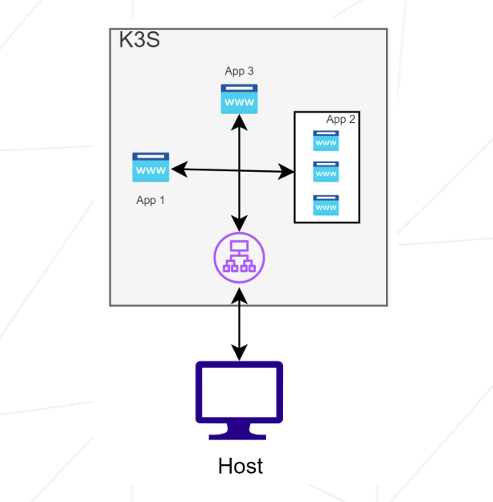
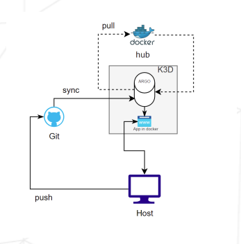

# Inception-Of-Things

*Figure: Learning curves for the Inception-Of-Things project.*

- intrudaction:
    This project aims to deepen my knowledge by using K3d and K3s with
    Vagrant.

- what is kubernetes:
    - **Kubernetes** is a tool that helps run and manage many
        containers automatically across multiple machines.
        It makes sure everything stays running, scales when needed,
        and organizes your apps for you.
    - **kubernetes component**
        - Control Plane (the brain)

            API Server – The front door; all commands go through it.

            Scheduler – Decides which node will run each pod.

            Controller Manager – Ensures everything matches the desired state (deployments, replicas, nodes, etc.).

            etcd – The database that stores the entire cluster state.

        - Worker Node Components (run your apps)

            Kubelet – Runs on each node; starts and monitors containers.

            Kube-Proxy – Handles network rules so services can talk to pods.

            Container Runtime – Runs the actual containers (containerd, CRI-O, etc.).

# p1: K3s and Vagrant
    - In this part, I created two lightweight virtual machines using Vagrant.
    Each machine has a custom hostname, passwordless SSH access, and follows
    modern Vagrant practices. K3s is installed on both: the first as the server
    (controller) node and the second as the worker (agent) node.
    $ cd p1
    $ vagrant up

# p2: K3s and three simple applications

In this project, I deployed a lightweight Kubernetes environment using K3s (server mode) on a single virtual machine. The goal was to run and expose three separate web applications through a single IP address using host-based routing.

✔️ What I Implemented
    - Installed and configured K3s on a VM (latest stable Linux distribution).
    - Deployed three custom web applications (app1, app2, app3) inside the K3s cluster.
    - Created Kubernetes Deployments and Services for each application.
    - Configured an Ingress to route traffic based on the Host header:
        app1.com → displays app1
        app2.com → displays app2
        Any other host → defaults to app3

# p3: K3d and Argo CD

In this phase, I moved beyond K3s and built a complete GitOps workflow using K3d, Argo CD, Docker, and GitHub. The goal was to automate application deployment using a lightweight Kubernetes cluster running inside Docker.

✔️ What I Accomplished
    1. K3d Environment Setup

        Installed Docker and all required dependencies using a fully automated installation script.
        Installed and configured K3d (K3s running inside Docker containers).
        Explained and demonstrated the difference between K3s (lightweight standalone Kubernetes) and K3d (K3s running in Docker-managed clusters).
        Created a working K3d cluster to serve as the foundation for GitOps.

    2. Namespace Architecture
        Created two dedicated namespaces:
            argocd → hosts the Argo CD control plane.
            dev → hosts the target application managed by Argo CD.

    3. GitOps with Argo CD
        Installed Argo CD in the cluster using official manifests.
        Exposed the Argo CD UI for management and verification.
        Connected Argo CD to a public GitHub repository containing all Kubernetes manifests.
        Repository name includes the login of a group member as required.

    4. Application Deployment
        Deployed an application managed 100% by Argo CD.
        The application supports two versions, using Docker image tags: v1 and v2

    5. Continuous Integration Workflow
        Updates pushed to the GitHub repository automatically trigger Argo CD to:
            Detect changes
            Sync configuration
            Deploy the correct application version inside the dev namespace
        Result: A fully working GitOps pipeline.

# bonus:
As an additional challenge, I extended the GitOps workflow by deploying a local GitLab instance directly inside the K3d cluster, replacing GitHub while keeping the same automated Argo CD deployment process from Part 3.

✔️ 1. Local GitLab Deployment
    Deployed GitLab as a Kubernetes Deployment using its Docker image (no Helm charts).
    Created a dedicated gitlab namespace.
    Exposed GitLab through a Service running inside the K3d cluster.

✔️ 2. Automated Installation Script

    To simplify setup during the defense, I wrote a full automation script that:
        . Installs all necessary dependencies
        . Deploys the GitLab resources inside the gitlab namespace.
        . Starts port-forwarding so the local machine can access the GitLab UI.
        . This script allows the entire environment to be recreated from scratch in just a few minutes.

✔️ 3. GitLab + Argo CD Integration

    Connected GitLab to the K3d cluster.
    Created a GitLab repository containing the application’s Kubernetes manifests.
    Configured Argo CD to pull from the GitLab repository.
    Reproduced the same GitOps process from Part 3:
        Argo CD continuously monitors the GitLab repo.
        Any push automatically triggers synchronization and deployment into the dev namespace.

✔️ 4. Application Deployment (v1 / v2)

    The same application from Part 3 is fully supported.
    Argo CD deploys both versions of the app: Tag v1 and v2
    Updating the tag or manifests in GitLab immediately updates the cluster through Argo CD.

