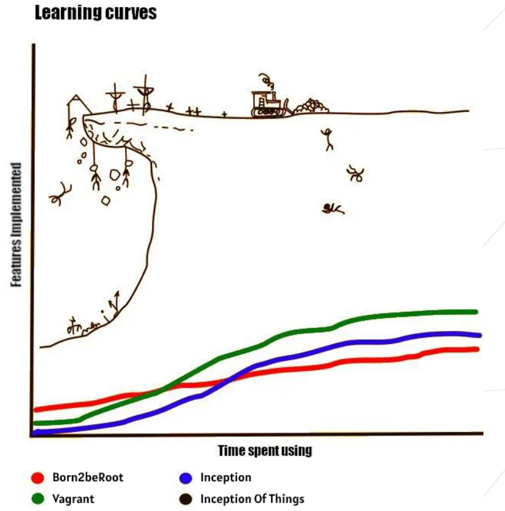

# Inception-Of-Things

*Figure: Learning curves for the Inception-Of-Things project.*

- intrudaction:
    This project aims to deepen my knowledge by using K3d and K3s with
    Vagrant.

- what is kubernetes:
    - **Kubernetes** is a tool that helps run and manage many
        containers automatically across multiple machines.
        It makes sure everything stays running, scales when needed,
        and organizes your apps for you.
        
        - kubelet, ....
        - deployment:
        - pod:
        - ingress:
        - service:
        - k3s:
        - k3d:

    - what is vangrant:
    - vangrantfile:

- argocd:

- gitlab:

# p1: K3s and Vagrant
    - In this part, I created two lightweight virtual machines using Vagrant.
    Each machine has a custom hostname, passwordless SSH access, and follows
    modern Vagrant practices. K3s is installed on both: the first as the server
    (controller) node and the second as the worker (agent) node.
    $ cd p1
    $ vagrant up
# p2: K3s and three simple applications
# p3: K3d and Argo CD
# bonus: